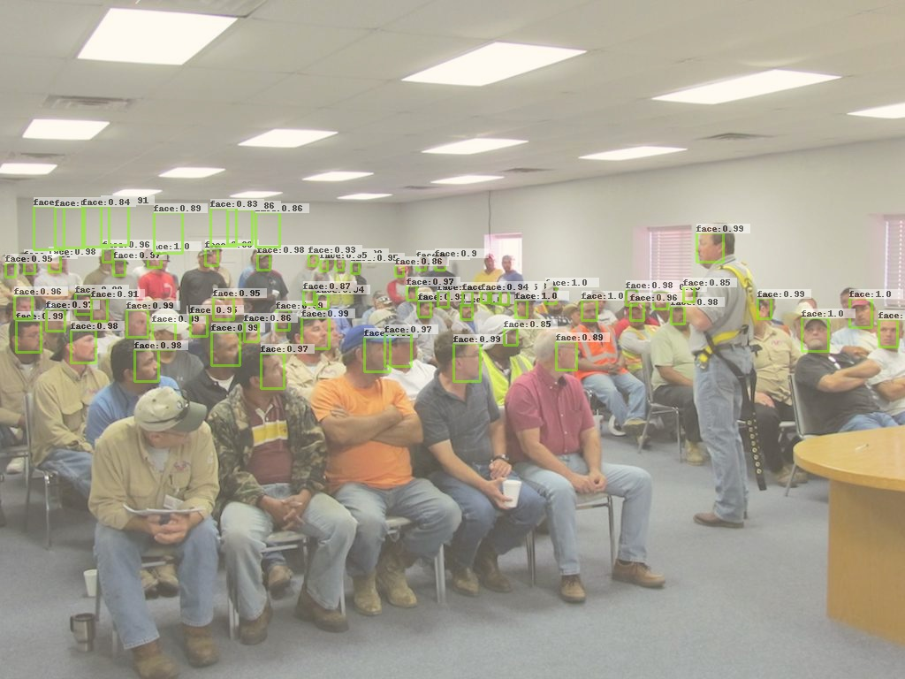

# SSH_Tensorflow (Development Version)

## Abstract
This is a tensorflow re-implementation of [ SSH: Single Stage Headless Face Detector](https://arxiv.org/pdf/1708.03979.pdf).     
[reference code](https://github.com/DetectionTeamUCAS/SSH_Tensorflow) 

## requist
tensorflow >=1.5.0

## WiderFace 

